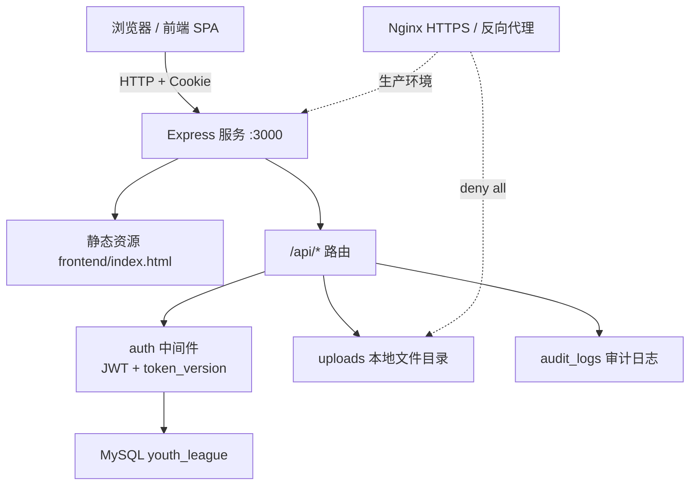
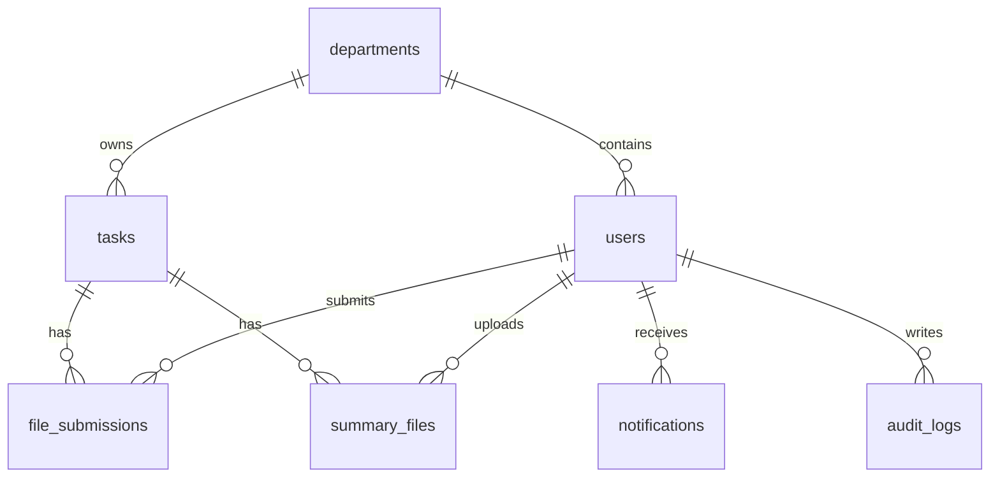
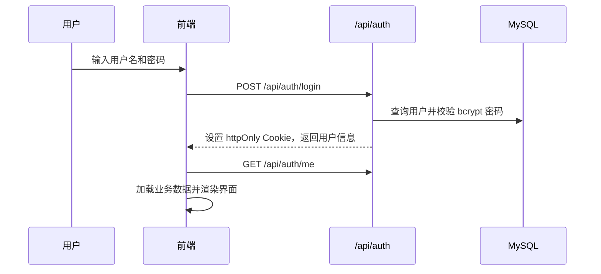
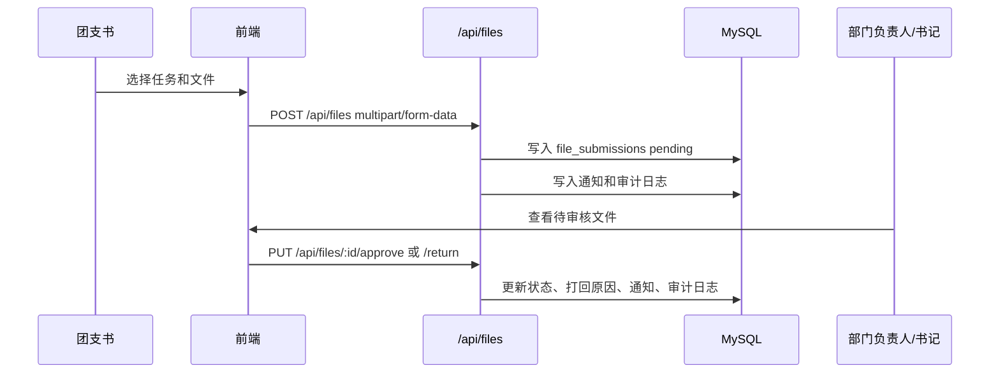
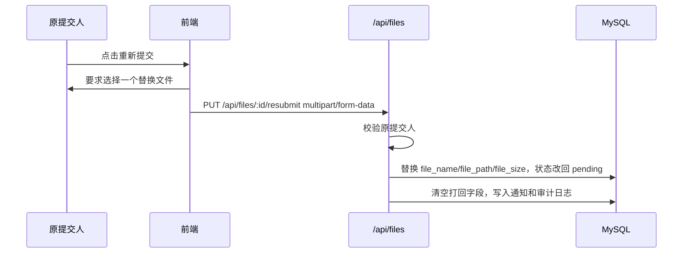

# 系统架构

更新时间：2026-05-28

## 1. 项目概览

本项目是面向计算机学院团委日常办公的 Web 系统，核心场景包括任务发布、部门协作、支部文件提交、文件审核/打回、汇总文件上传、通知和审计追踪。

系统采用 Node.js + Express + MySQL 后端，前端为单文件 SPA，静态页面和 API 均由同一个 Express 服务提供。

## 2. 技术栈

| 层级 | 技术 |
|---|---|
| 前端 | HTML5、CSS3、原生 JavaScript、Fetch API |
| 后端 | Node.js、Express |
| 数据库 | MySQL、mysql2/promise |
| 认证 | JWT、httpOnly Cookie、bcryptjs |
| 文件上传 | multer、本地 uploads 目录 |
| 安全 | helmet、cors、express-rate-limit、token_version |
| 部署 | PM2、Nginx、HTTPS、HSTS |

## 3. 目录结构

```text
计算机学院团委办公系统/
├─ backend/
│  ├─ config/
│  │  └─ db.js                 # MySQL 连接池
│  ├─ middleware/
│  │  └─ auth.js               # JWT + token_version 认证中间件
│  ├─ routes/
│  │  ├─ auth.js               # 登录、退出、当前用户、改密
│  │  ├─ users.js              # 用户管理
│  │  ├─ departments.js        # 部门管理
│  │  ├─ tasks.js              # 任务管理
│  │  ├─ files.js              # 文件提交、审核、打回、重新提交、下载
│  │  ├─ summary.js            # 汇总文件上传、下载
│  │  └─ notifications.js      # 通知
│  ├─ utils/
│  │  ├─ auditLog.js           # 审计日志工具
│  │  ├─ assignment.js         # 派发标签解析与人员匹配
│  │  └─ fileName.js           # 上传文件名编码修复
│  └─ server.js                # Express 入口
├─ frontend/
│  └─ index.html               # 单文件 SPA
├─ database/
│  └─ init.js                  # 数据库初始化脚本
├─ deploy/
│  ├─ nginx.conf               # Nginx 配置
│  └─ deploy.sh                # 部署脚本
├─ uploads/                    # 运行时上传目录，Git 忽略
├─ logs/                       # PM2 日志目录，Git 忽略
├─ .env.example
├─ ecosystem.config.js
├─ package.json
└─ 系统架构.md
```

## 4. 运行架构



## 5. 数据库设计

数据库名：`youth_league`

### 5.1 表关系



### 5.2 核心表

| 表 | 说明 |
|---|---|
| `departments` | 部门信息，包含名称、颜色、负责人字段 |
| `users` | 用户、角色、部门、密码哈希、`token_version` |
| `tasks` | 任务标题、分类、频率、时间、负责部门、派发标签/人员、状态 |
| `file_submissions` | 支部提交文件、审核状态、打回原因、提交人和部门 |
| `summary_files` | 汇总文件，关联任务、上传人、部门 |
| `notifications` | 用户通知和已读状态 |
| `audit_logs` | 关键操作审计日志 |

### 5.3 角色枚举

```text
secretary        团委书记
viceSecretary    团委副书记
minister         部长
viceMinister     副部长
member           部员
branchSecretary  团支书
```

## 6. 后端架构

### 6.1 Express 入口

`backend/server.js` 负责：

- 加载 `.env` 环境变量。
- 校验 `JWT_SECRET`，生产环境校验 `DB_PASSWORD`。
- 挂载 `helmet`、`cors`、`cookie-parser`、`express.json()`。
- 提供 `frontend/` 静态文件。
- 挂载 `/api/auth`、`/api/users`、`/api/departments`、`/api/tasks`、`/api/files`、`/api/summary`、`/api/notifications`。
- 提供 SPA 回退路由。
- 提供受认证保护的 `/api/upload` 通用上传入口。

### 6.2 认证与授权

`backend/middleware/auth.js` 提供两个核心函数：

| 函数 | 说明 |
|---|---|
| `authenticateToken` | 从 httpOnly Cookie 读取 JWT，验证签名后查询数据库用户，并校验 `token_version` |
| `requireRole(...roles)` | 校验当前用户角色是否在允许列表中 |

当前实现中，所有受保护接口都会重新查询用户表并校验 `token_version`。因此修改密码或角色更新后，旧 token 会失效。

### 6.3 API 路由

| 路由 | 文件 | 功能 |
|---|---|---|
| `/api/auth` | `routes/auth.js` | 登录、退出、当前用户、改密 |
| `/api/users` | `routes/users.js` | 用户列表、创建、更新、角色变更、部门变更、删除 |
| `/api/departments` | `routes/departments.js` | 部门列表、创建、更新、删除 |
| `/api/tasks` | `routes/tasks.js` | 任务列表、创建、编辑、状态更新、删除 |
| `/api/files` | `routes/files.js` | 文件提交、列表、下载、审核、打回、重新提交 |
| `/api/summary` | `routes/summary.js` | 汇总文件列表、上传、下载 |
| `/api/notifications` | `routes/notifications.js` | 通知列表、标记已读 |

补充接口：`GET /api/users/assignees` 返回派发选择器所需的基础人员列表，非书记角色也可读取，用于任务派发与完成情况统计。

### 6.4 任务派发模型

`tasks.assigned_to` 当前为 `TEXT`，保存派发规则。系统仍兼容历史值 `all` 和 `branchSecretaries`，新规则使用 JSON 保存标签与人员 ID。

```json
{
  "mode": "partial",
  "tags": ["committee:leaders:all", "committee:dept:dept1", "branch:all"],
  "users": []
}
```

当前派发标签如下：

| 标签 | 含义 |
|---|---|
| `committee:secretariat` | 团委（副）书记 |
| `committee:leaders:all` | 全体部长 |
| `committee:leaders:dept:<department_id>` | 指定部门部长；办公室显示为“办公室主任”，其它部门显示为“某某部部长” |
| `committee:dept:all` | 全部部门 |
| `committee:dept:<department_id>` | 指定部门 |
| `branch:all` | 全体团支书 |

前端派发选择器只展示两个大类：团委工作人员、团支书。团委工作人员下分为团委（副）书记、部长、部门三块；团支书只支持全体团支书，不支持单选。

## 7. 文件权限模型

### 7.1 文件提交 `file_submissions`

| 操作 | 权限规则 |
|---|---|
| 列表 | 书记/副书记看全部；团支书只看自己提交；部长/副部长/部员看本部门 |
| 提交 | 仅团支书可提交，记录任务所属部门 |
| 下载 | 书记/副书记、提交人本人、本部门部长/副部长/部员可下载 |
| 审核通过 | 书记/副书记可审核全部；部长/副部长只能审核本部门 |
| 打回 | 书记/副书记可打回全部；部长/副部长只能打回本部门 |
| 重新提交 | 仅原提交人可重新上传替换文件 |
| 删除已打回记录 | 仅书记/副书记可删除状态为 `returned` 的提交记录 |

团支书提交文件时，后端会根据任务 `assigned_to` 解析派发名单；只有被派发到该任务的团支书才能提交。

重新提交接口为：

```text
PUT /api/files/:id/resubmit
Content-Type: multipart/form-data
file=<replacement>
```

### 7.2 汇总文件 `summary_files`

| 操作 | 权限规则 |
|---|---|
| 列表 | 书记/副书记看全部；部长/副部长/部员看本部门；其它角色只看自己上传 |
| 上传 | 书记/副书记/部长可上传；部长只能上传本部门任务汇总 |
| 下载 | 书记/副书记、上传者本人、本部门部长/副部长/部员可下载 |

上传文件名会经过 `utils/fileName.js` 处理，修复 Windows/浏览器 multipart 上传中中文文件名被解析成 mojibake 的问题，例如 `新建 文本文档.txt` 会恢复为 `新建 文本文档.txt`。

## 8. 前端架构

前端集中在 `frontend/index.html`，包含 HTML、CSS 和 JavaScript。

### 8.1 核心模块

| 模块 | 说明 |
|---|---|
| `API` | 封装 `get/post/put/del/upload/uploadPut`，统一处理 Cookie、401 和错误 |
| `mapTask/mapFile/...` | 将后端 `snake_case` 映射为前端 `camelCase` |
| `state` | 保存当前用户、当前导航、筛选条件、待上传文件、重提交文件 ID 等 |
| 权限函数 | `canPublishTask`、`canSubmitFile`、`canReturnFileFromFileDept` 等 |
| 渲染函数 | `renderTasks`、`renderFiles`、`renderDepartments`、`renderNotifications` 等 |
| 上传交互 | 支持拖拽上传、多文件提交、汇总文件上传、替换文件重新提交 |
| 派发选择器 | 支持按团委标签或团支书标签派发任务，选中标签以圆角矩形高亮显示 |
| 完成情况视图 | 任务详情中按派发名单展示团支书提交情况，显示已交/应交、搜索和未提交提示 |

### 8.2 数据加载

登录后前端会调用：

```text
GET /api/tasks
GET /api/departments
GET /api/users
GET /api/files
GET /api/summary
GET /api/notifications
```

`/api/users` 仅书记可访问，前端已将它作为可选数据处理。非书记角色无法访问用户列表时，会降级调用 `GET /api/users/assignees`，不影响任务、文件、汇总、通知、派发选择器和完成情况统计。

### 8.3 字段映射

| 后端字段 | 前端字段 |
|---|---|
| `department_id` | `department` |
| `assigned_to` | `assignedTo` |
| `is_regular` | `isRegular` |
| `time_slot` | `timeSlot` |
| `task_id` | `taskId` |
| `file_name` | `fileName` |
| `file_size` | `fileSize` |
| `submitted_by` | `submittedBy` |
| `submitted_by_name` | `submittedByName` |
| `submitted_at` | `submittedAt` |
| `return_reason` | `returnReason` |
| `uploaded_by` | `uploadedBy` |
| `uploaded_at` | `uploadedAt` |
| `target_user` | `targetUser` |
| `is_read` | `read` |

## 9. 关键业务流程

### 9.1 登录



### 9.2 文件提交与审核



### 9.2.1 常态化任务与频次联动

| 类型 | 频次规则 |
|---|---|
| 常态化 | 前端显示频次，且只允许 `每年` |
| 一次性 | 前端隐藏频次，后端统一保存为 `不定期` |

后端在创建和更新任务时也会兜底处理，避免前端绕过联动规则。

### 9.3 文件重新提交



## 10. 安全机制

| 机制 | 说明 |
|---|---|
| httpOnly Cookie | JWT 不暴露给前端 JavaScript |
| SameSite=Lax | 降低 CSRF 风险 |
| Secure Cookie | 生产环境启用，仅 HTTPS 传输 |
| `token_version` | 用户改密或角色变更后旧 token 失效 |
| 登录限流 | `/api/auth/login` 15 分钟最多 5 次 |
| CORS | 仅允许 `CORS_ORIGIN` 配置的来源 |
| Helmet | 设置常见安全响应头，当前 CSP 因单文件内联脚本暂时关闭 |
| 文件白名单 | 仅允许 doc/docx/pdf/xls/xlsx/ppt/pptx/txt/csv/jpg/jpeg/png/gif/zip/rar |
| 文件大小限制 | 默认 10MB，可通过 `MAX_FILE_SIZE` 配置 |
| 认证下载 | 上传文件不通过静态目录公开，只通过带权限校验的 API 下载 |
| Nginx deny | 生产环境禁止直接访问 `/uploads` |
| 审计日志 | 记录登录、退出、改密、任务、文件、审核、打回、重提交等关键操作 |

## 11. 环境变量

| 变量 | 说明 | 默认/示例 |
|---|---|---|
| `NODE_ENV` | 运行环境 | `development` |
| `DB_HOST` | 数据库地址 | `localhost` |
| `DB_PORT` | 数据库端口 | `3306` |
| `DB_USER` | 数据库用户 | `root` |
| `DB_PASSWORD` | 数据库密码 | 开发默认 `123456`，生产必须设置 |
| `DB_NAME` | 数据库名 | `youth_league` |
| `PORT` | Express 端口 | `3000` |
| `JWT_SECRET` | JWT 密钥 | 必须设置 |
| `CORS_ORIGIN` | 允许的前端来源 | `http://localhost:3000` |
| `MAX_FILE_SIZE` | 上传大小限制，字节 | `10485760` |

## 12. 本地运行

```bash
npm install
npm run init-db
npm start
```

访问：

```text
http://localhost:3000
```

当前项目在 Windows PowerShell 下如果遇到 `npm.ps1` 执行策略限制，可使用：

```bash
npm.cmd start
```

## 13. 部署说明

生产环境推荐：

1. 使用 PM2 启动 Node 服务。
2. 使用 Nginx 终止 HTTPS，并反向代理 `/api/` 到 `127.0.0.1:3000`。
3. Nginx 对 `/uploads` 配置 `deny all`。
4. 设置强随机 `JWT_SECRET` 和数据库密码。
5. 配置 `CORS_ORIGIN` 为真实域名。

## 14. 最近更新

### 2026-05-28

- 新增任务派发标签模型，支持按团委标签和团支书标签派发任务。
- 派发选择器改为圆角矩形选中态，不显示复选框。
- 团委工作人员派发标签简化为团委（副）书记、部长、部门三块；团支书仅支持全体团支书。
- 常态化任务与频次联动：常态化只保留每年，一次性隐藏频次并保存为不定期。
- 新增任务完成情况宫格，按派发名单展示团支书已交/未交。
- 新增书记/副书记删除已打回提交记录权限。
- 新增上传文件名编码修复工具，修复中文文件名乱码。
- 修复文件列表、下载、审核、打回的部门级权限边界。
- 修复汇总文件列表、上传、下载的部门级权限边界。
- 修复打回原因字段不一致，后端兼容 `reason` 和 `return_reason`。
- 修复重新提交逻辑，现在必须上传替换文件，并更新文件名、路径、大小和状态。
- 修复任务状态更新会清空其它字段的问题。
- 修复前端读取后端包装响应对象的问题。
- 修复非书记角色访问 `/api/users` 失败导致整页数据加载失败的问题。
- 所有受保护接口统一校验数据库中的用户和 `token_version`。
- `/api/upload` 增加登录认证。
- 用户角色变更和用户信息更新后递增 `token_version`，旧会话失效。

### 历史能力

- 支持任务发布、部门空间、文件提交、文件审核、汇总上传、通知和审计日志。
- 支持 PM2/Nginx 部署。
- 支持 httpOnly Cookie 登录态、登录限流、上传白名单和文件大小限制。
